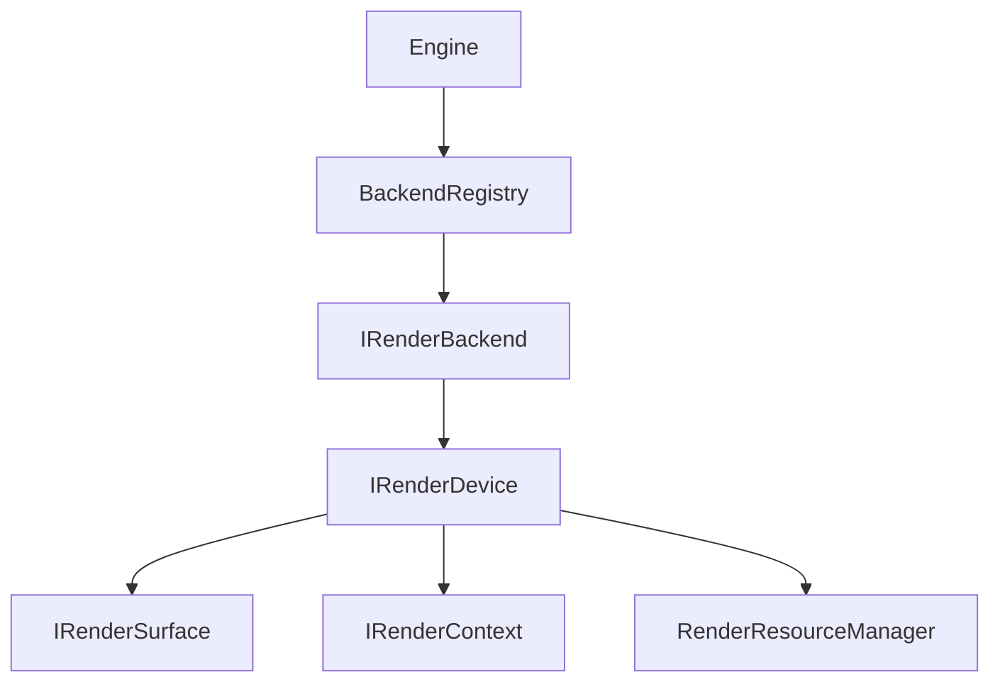

# Renderer Architecture

LumaWall's renderer is decoupled entirely from platform semantics. It knows nothing of Wayland, X11, or Qt, ensuring ultimate portability and enforcing strict boundaries.

## Architecture

At the top level, we rely on the `BackendRegistry` which discovers and initializes the best available `IRenderBackend`. 

Each backend (Vulkan, OpenGL, Mock) implements:
1. `IRenderBackend`: Initialization and global state.
2. `IRenderDevice`: Abstraction of the GPU device, responsible for creating contexts and surfaces.
3. `IRenderSurface`: The visual target bound to an OS window (e.g., a Swapchain).
4. `IRenderContext`: A command buffer abstraction for recording drawing commands.

## Abstraction Levels

By keeping these abstractions purely virtual and strictly managed via `std::unique_ptr` and `std::shared_ptr`, we achieve a zero-cost abstraction penalty at runtime while maximizing modularity.
